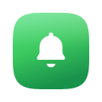
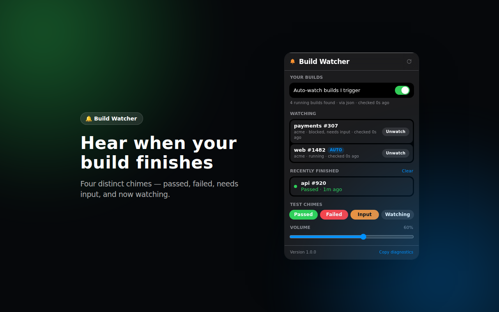
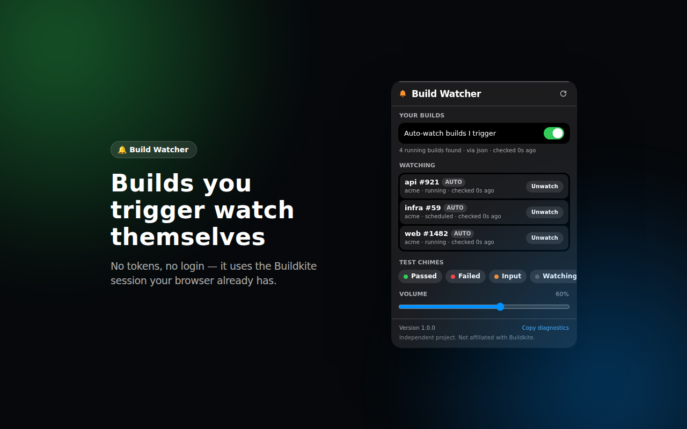
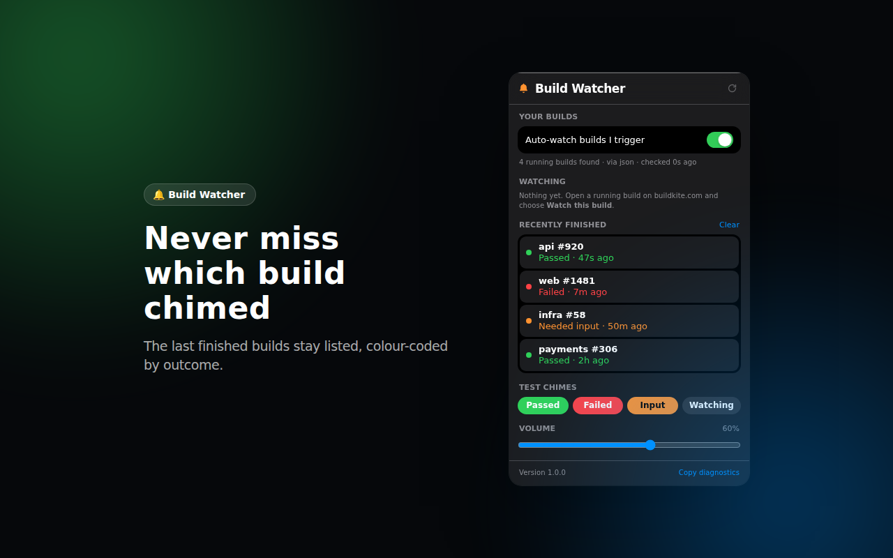

  

<h1 align="center">Buildkite Build Watcher</h1>

  <strong>Stop watching the build log. Hear it finish instead.</strong>

  
  <!-- store: replace this badge with a link to the listing once the review clears -->
  
  
  

  An independent open-source project. Not affiliated with, endorsed by, or sponsored by Buildkite.

 

  

 

You kick off a build. You know it'll take eleven minutes. So you open something else, and then you
spend those eleven minutes glancing back at the tab to see if it's green yet.

Build Watcher ends that. It notices when you're looking at a build that's still running, offers to
watch it, and plays a sound the moment it's done — one sound for passed, a different one for failed,
another when a step is blocked waiting on you. Go do the other thing. You'll hear it.

## What you hear

| | Sound | When |
|---|---|---|
| 🟢 **Passed** | a rising four-note chime | the build went green |
| 🔴 **Failed** | two descending tones | it failed, or someone cancelled it |
| 🟠 **Needs input** | a double ping, repeated once | a block step is waiting for you to unblock it |
| ⚪ **Now watching** | two soft blips, quieter than the rest | a build you triggered was picked up on its own |

After a *needs input* chime it keeps watching. Unblock the step and you'll hear the pass or fail when the
build finally finishes.

Every sound is synthesised. There are no audio files, and there's a volume slider and a **test** button
for each one in the popup, so you can hear them before you rely on them.

## Builds you start watch themselves

Turn on **Auto-watch builds I trigger** and anything you kick off is picked up within a minute, read from
the same *My Builds* list you already see in Buildkite. No adding by hand. You can still watch anyone
else's build from its page — the banner offers to.

  

It's built to stay quiet:

- Builds already running when you switch it on are ignored, so enabling it is never a burst of chimes.
- Unwatch something and it stays unwatched.
- Five builds arriving together make one soft sound, not five.

## It tells you which one

  

A desktop notification names the pipeline and build number, and clicking it opens the build. Miss the
chime entirely and the popup still has it: **Recently finished** keeps the last dozen builds that chimed,
colour-coded by outcome, so you always know what happened while you were away.

## Nothing to set up

No API token. No login. No account. It reads build status using the Buildkite session your browser
already has — the same pages you can open yourself. Install it and open a build.

If you're signed out of Buildkite, it says so and waits, rather than failing quietly.

## Nothing leaves your browser

There is no server, no analytics, no telemetry, no remote code. The builds you're watching and your
settings live in your browser's local storage and are never transmitted anywhere. The only network
requests are to buildkite.com.

That isn't a promise buried in a policy; it's a consequence of how it's built. The full source is here,
the [privacy policy](PRIVACY.md) is two screens long, and the permission list is short:

`buildkite.com` · `alarms` · `storage` · `notifications` · `offscreen`

The **Copy diagnostics** link in the popup exists for bug reports. It copies a report with organisation
and pipeline names replaced by placeholders and nothing sensitive included — you decide whether to paste
it anywhere.

## Install

**From the Chrome Web Store** — the listing is in review. The link will appear here once it's live.

**Or load it yourself**, right now:

1. Download the latest `buildkite-build-watcher-<version>.zip` from
   [Releases](https://github.com/naman-kumar2397/chrome_buildkite/releases) and unzip it, or clone this repo.
2. Open `chrome://extensions`, turn on **Developer mode**, click **Load unpacked**, and pick the folder.
3. Open any running build on buildkite.com. A bar appears at the top: **Watch this build**.

Works with **buildkite.com** on Chrome 120 or newer. Self-hosted Buildkite instances aren't supported yet.

## Made to feel at home

The interface follows Apple's Human Interface Guidelines: the system font, the real system colours in
light and dark, spring motion that stands down when you've asked for reduced motion, and glass only where
the guidelines put it. Every piece of text is measured against its own rendered pixels for WCAG AA
contrast, in both appearances, on every push — so it's legible over Buildkite's dark UI and on a light
one alike.

## For developers

It's plain JavaScript and Manifest V3 with no build step. [CONTRIBUTING.md](CONTRIBUTING.md) covers how
build state is fetched, the design rules and how they're enforced, and every check you can run.

[Changelog](CHANGELOG.md) · [Privacy](PRIVACY.md) · [Security](SECURITY.md) · [Licence](LICENSE)

 

  Buildkite is a trademark of Buildkite Pty Ltd. This project is not affiliated with Buildkite.

